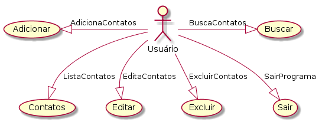
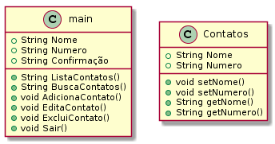

# Agenda básica de contatos

Projeto com funções simples para entender o funcionamento da leitura e gravação de arquivos.

| Opões | Detalhamento |
|-------|--------------|
| 1-Contatos | Lista a atual lista com os nomes e números dos contatos |
| 2-Buscar | Busca um contato específico pelo nome ou parte do nome |
| 3-Adicionar | Adiciona um novo contato para a agenda e após isso chama a função de gravação |
| 4-Editar | Edita um contato, sendo possivel alterar o nome ou o número e após isso chama a função de gravação |
| 5-Excluir | Remove da agenda o contato e após isso chama a função de gravação |
| 9-Sair | Finaliza o programa |

## Documentação

Caso de Uso

Diagrama de Classe

